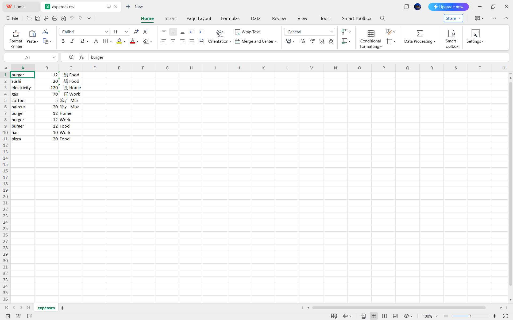
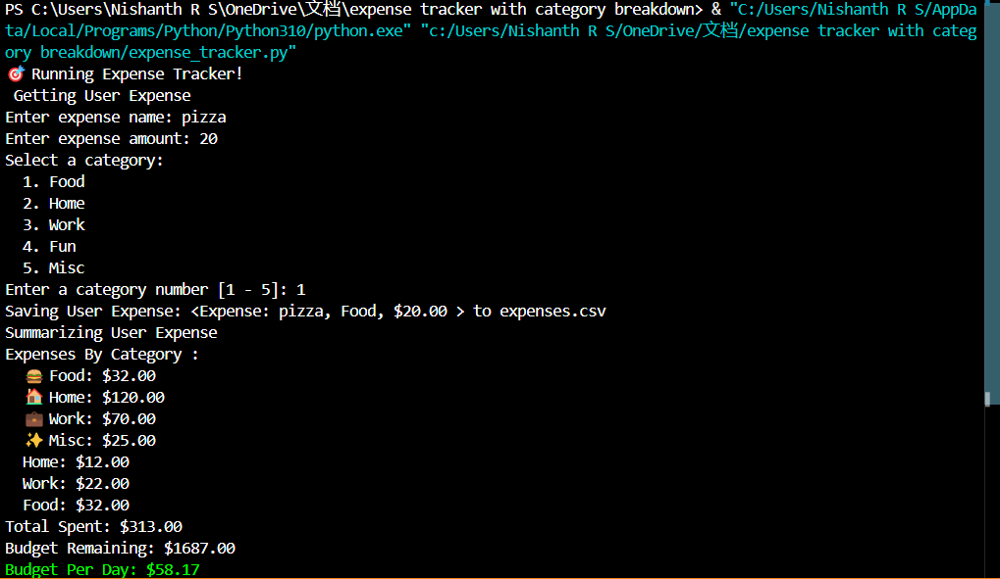

# FINAL PROJECT: Expense Tracking with Category

## Objective
The goal of this project is to **track and categorize monthly expenses** and assist users in managing their budget effectively.

This terminal-based app allows users to input their expense details (category and amount), saves the data into a file, and provides a summary of their monthly spending. It also informs users of their remaining budget for the month.budget 

## TEAM:

1. PRANAV K 
2. NISHANTH R S
3. JOSITHA SHREE 

## REQUIREMENTS/OUTCOMES

1. Expense (name, category, amount)
2. Save expense entries to a '.csv' file.
3. Read the file to summarise the expense totals for that month
4. Show the user how much they can spend for the rest of the month (to stay in budget)

## Project Structure

Consist of 2 files:

1. `expense.py`: A class for creating and storing expense objects.
2. `expense_tracker.py`: The main application logic.

## PROCEDURE

1. Create the `expense.py` class.
2. Create the `expense_tracker.py` file and write the main logic.
3. Run and execute.

## Screenshot

